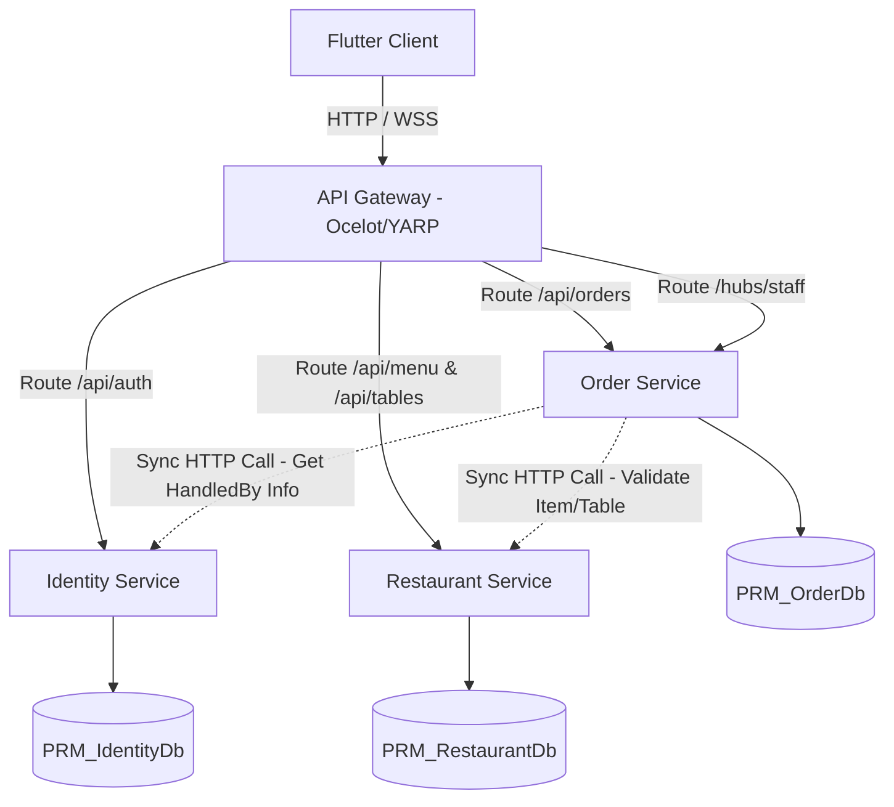

# 🗺️ Kế Hoạch Chi Tiết Chuyển Đổi Sang Kiến Trúc Microservices (PRM Backend)

Tài liệu này trình bày kế hoạch chuyển đổi hệ thống Backend hiện tại của ứng dụng gọi món (PRM Backend) từ kiến trúc Monolith (Đơn khối) sang **Microservices (Vi dịch vụ)** sử dụng **ASP.NET Core (.NET 8)**.

---

## 🏗️ 1. Kiến Trúc Tổng Quan (Target Architecture)

Hệ thống sẽ được chia thành **5 thành phần** độc lập:



---

## 📦 2. Chi Tiết Từng Services & Cơ Sở Dữ Liệu (Database Split)

### 2.1. API Gateway (Port: 5000)
* **Công nghệ**: Ocelot hoặc YARP (Yet Another Reverse Proxy).
* **Trách nhiệm**: 
  * Cổng đón nhận duy nhất (Single Entry Point) cho Flutter client.
  * Phân luồng các request tới đúng Microservice phía sau.
  * Tích hợp cấu hình CORS tập trung.
  * **Centralized JWT Authentication**: Xác thực JWT token tại Gateway trước khi chuyển tiếp request vào bên trong mạng nội bộ (Internal Network).

### 2.2. Identity Service (Port: 5001)
* **Trách nhiệm**: Quản lý Tài khoản (Account) & Phân quyền (Admin, Staff, Customer).
* **Bảng Database (`PRM_IdentityDb`)**:
  * `Accounts` (AccountId, Username, Email, PasswordHash, FullName, PhoneNumber, Role, IsActive, CreatedAt, LastLoginAt)
* **Các API endpoints**:
  * `POST /api/auth/login` (Xác thực thông tin và sinh JWT token)
  * `POST /api/auth/register` (Khách hàng đăng ký)
  * `POST /api/auth/admin-create` (Tạo tài khoản Staff)
  * `PUT /api/auth/accounts/{id}` (Cập nhật thông tin tài khoản)
  * `DELETE /api/auth/accounts/{id}` (Xóa mềm tài khoản)
  * `GET /api/auth/staff` (Lấy danh sách nhân viên)

### 2.3. Restaurant Service (Port: 5002)
* **Trách nhiệm**: Quản lý thực đơn (Menu Items) và tình trạng bàn ăn (Tables).
* **Bảng Database (`PRM_RestaurantDb`)**:
  * `MenuItems` (MenuItemId, Name, Description, Price, ImageUrl, IsAvailable, CreatedAt)
  * `Tables` (TableId, Capacity, Status [Available/Occupied/Reserved], CreatedAt)
* **Các API endpoints**:
  * `GET/POST/PUT/DELETE /api/menu` (Quản lý món ăn)
  * `GET/POST/PUT/DELETE /api/tables` (Quản lý bàn ăn và trạng thái bàn)

### 2.4. Order & Notification Service (Port: 5003)
* **Trách nhiệm**: Quản lý việc đặt món, hóa đơn và đồng bộ SignalR real-time cho nhân viên.
* **Bảng Database (`PRM_OrderDb`)**:
  * `Orders` (OrderId, TableId, Status, TotalAmount, Note, HandledBy, CreatedAt, UpdatedAt)
  * `OrderItems` (OrderItemId, OrderId, MenuItemId, Quantity, UnitPrice, Note)
* **Real-time Hub**: `StaffNotificationHub` (`/hubs/staff`) sẽ được host trực tiếp trên service này.
* **Giao tiếp liên dịch vụ (Inter-service Communication)**:
  * Khi gọi `POST /api/orders` hoặc `POST /api/orders/{id}/items`: Order Service cần kiểm tra xem `TableId` có hợp lệ không, và các `MenuItemId` có tồn tại/còn hàng không. Việc này sẽ thực hiện qua **HttpClient gọi đồng bộ** sang *Restaurant Service* (ví dụ: `GET /api/tables/{id}` và `GET /api/menu/validate-items`).
  * Khi cập nhật trạng thái đơn (Hoàn thành/Hủy), Order Service cần gọi sang *Restaurant Service* để giải phóng trạng thái bàn ăn về `Available` (1).

### 2.5. Giải Quyết Liên Kết Khóa Ngoại (Foreign Key & Relationships) giữa các DB
Trong kiến trúc Monolith, các bảng được liên kết chặt chẽ thông qua các khóa ngoại (Foreign Keys) vật lý như:
* `Orders.TableId` ➡️ `Tables.TableId`
* `Orders.HandledBy` ➡️ `Accounts.AccountId`
* `OrderItems.MenuItemId` ➡️ `MenuItems.MenuItemId`

Khi tách thành **Database per Service**, các khóa ngoại vật lý này **bắt buộc phải bị xóa bỏ** vì cơ sở dữ liệu của các service nằm ở các server/schema độc lập. Cách giải quyết:
1. **Liên kết logic (Logical Reference)**:
   * Trong database `PRM_OrderDb`, ta vẫn giữ lại các trường `TableId`, `HandledBy` (trong bảng `Orders`) và `MenuItemId` (trong bảng `OrderItems`) dưới dạng kiểu dữ liệu số (`INT`) thuần túy.
   * Xóa bỏ các ràng buộc khóa ngoại vật lý (`CONSTRAINT FK_...`) trong Database DDL script.
   * Trong code C# Entity Framework Core của `OrderService`, xóa bỏ các Navigation Properties (ví dụ: `public virtual Table Table { get; set; }` hoặc `public virtual Account HandledByNavigation { get; set; }`). Thay vào đó chỉ giữ lại ID (`public int TableId { get; set; }`).
2. **Kỹ thuật Stitching (Gộp dữ liệu ở tầng Ứng dụng)**:
   * Khi trả về thông tin đơn hàng đầy đủ cần có tên món ăn (`MenuItemName`): Order Service sẽ gọi HTTP sang Restaurant Service để lấy thông tin chi tiết của các món ăn theo danh sách `MenuItemId`, sau đó tự map tên món ăn vào DTO trả về cho Flutter client.
3. **Tính toàn vẹn dữ liệu (Data Integrity)**:
   * Khi xóa một bàn hoặc một món ăn ở Restaurant Service, ta phải dùng cơ chế **Event-driven (như Message Queue)** gửi thông báo đến Order Service để cập nhật hoặc chặn xóa nếu đang có hóa đơn active. Hoặc đơn giản là kiểm tra tính hợp lệ qua HTTP API trước khi thực hiện.

---

## 🛠️ 3. Các Bước Triển Khai Chi Tiết (Step-by-Step Implementation Plan)

### Bước 1: Chuẩn bị Solution và Dự án mới
1. Tạo một Solution trống (.sln).
2. Tạo 4 Web API projects mới:
   * `PRM.Gateway`
   * `PRM.Services.Identity`
   * `PRM.Services.Restaurant`
   * `PRM.Services.Order`
3. Tạo 1 Class Library chung (`PRM.Shared`) để chứa các helper dùng chung: Enums (`MenuCategory`, `TableStatus`), DTOs chung, Middleware xử lý lỗi.

### Bước 2: Tách Cơ sở dữ liệu và EF Core Migrations
1. Tạo 3 database riêng biệt trên SQL Server: `PRM_IdentityDb`, `PRM_RestaurantDb`, `PRM_OrderDb`.
2. Tạo các DbContext riêng cho mỗi service:
   * `IdentityDbContext` chứa DbSet cho `Account`.
   * `RestaurantDbContext` chứa DbSet cho `MenuItem` và `Table`.
   * `OrderDbContext` chứa DbSet cho `Order` và `OrderItem` (Không cấu hình Foreign Key vật lý với `Account` hay `Table` của DB khác, chỉ lưu Id làm liên kết logic).
3. Chạy lệnh Add-Migration cho từng DbContext để tạo cấu trúc DB riêng biệt.

### Bước 3: Di chuyển Code Controller và DTOs
1. **Identity Service**: Di chuyển toàn bộ code của `AuthController.cs` sang đây. Cấu hình JWT Service để sinh Token.
2. **Restaurant Service**: Di chuyển `MenuController.cs` và `TablesController.cs` sang đây.
3. **Order Service**: Di chuyển `OrdersController.cs`, các file SignalR (`Hubs/`, `Notifications/`) sang đây.

### Bước 4: Xử lý giao tiếp liên dịch vụ (Inter-service Communication)
1. Trong dự án `PRM.Services.Order`, tạo các interface:
   * `IRestaurantServiceClient` để định nghĩa các phương thức gọi sang Restaurant Service (Validate Table, Release Table, Validate Items).
2. Viết class implement bằng `HttpClient` kết hợp `HttpClientFactory` của .NET 8.
3. Ví dụ:
   ```csharp
   public async Task<bool> IsTableAvailableAsync(int tableId)
   {
       var response = await _httpClient.GetAsync($"api/tables/{tableId}/status");
       if (!response.IsSuccessStatusCode) return false;
       var status = await response.Content.ReadFromJsonAsync<int>();
       return status == 1; // Available
   }
   ```

### Bước 5: Cấu hình Gateway (Ocelot)
1. Thêm package `Ocelot` vào dự án `PRM.Gateway`.
2. Cấu hình file `ocelot.json` định tuyến các route từ bên ngoài vào các port local của từng service:
   * `/api/auth/{everything}` ➡️ `http://localhost:5001/api/auth/{everything}`
   * `/api/menu/{everything}` ➡️ `http://localhost:5002/api/menu/{everything}`
   * `/api/tables/{everything}` ➡️ `http://localhost:5002/api/tables/{everything}`
   * `/api/orders/{everything}` ➡️ `http://localhost:5003/api/orders/{everything}`
   * Cấu hình WebSocket (SignalR) đi qua Gateway cho route `/hubs/staff`.
3. Tích hợp JWT Authentication tại Gateway để kiểm tra tính hợp lệ của Token trước khi request đi tới các service bên trong.

### Bước 6: Kiểm thử và Triển khai
1. Chạy thử nghiệm tất cả các Service cục bộ dưới máy Dev bằng cách dùng file `launchSettings.json` hoặc chạy nhiều lệnh `dotnet run`.
2. Cập nhật Flutter Client trỏ Base URL về địa chỉ của API Gateway thay vì API Backend cũ.
3. Triển khai Docker: Viết `Dockerfile` cho từng service và một file `docker-compose.yml` để dễ dàng khởi chạy toàn bộ hệ thống bằng 1 câu lệnh duy nhất: `docker-compose up --build`.

---

## ⚡ 4. Điểm Cộng Về Mặt Học Thuật (Academic Advantages)

Nếu trình bày đồ án này cho giảng viên, bạn sẽ nhận được điểm cộng lớn khi nêu bật các công nghệ microservices hiện đại được áp dụng:
1. **Database per Service**: Đảm bảo tính lỏng lẻo (loose coupling), mỗi service tự quản lý dữ liệu của mình.
2. **Centralized Authentication ở Gateway**: Giảm thiểu việc các service con phải tự xác thực lại JWT token, giúp tăng hiệu năng hệ thống.
3. **Resilience & Fault Tolerance**: Tích hợp các thư viện như Polly (trong HttpClient) để tự động thử lại (retry) hoặc ngắt mạch (Circuit Breaker) khi một service con gặp sự cố, đảm bảo toàn bộ hệ thống không bị sập theo.
4. **Containerization (Docker)**: Giúp đóng gói các microservices chạy đồng bộ ở mọi môi trường mà không lo xung đột cấu hình.
